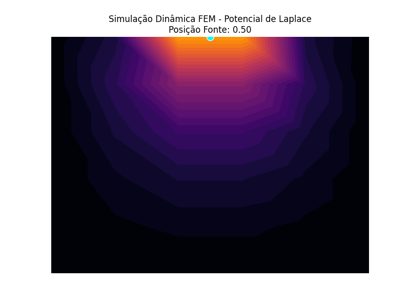

# 🚀 PyFEM: Dynamic Ground Truth Generator para Physics-Informed AI


> **Simulação da resposta transiente de um campo de potencial submetido a uma fonte móvel (Kernel Gaussiano RBF).**



_(Se o GIF não carregar automaticamente, certifique-se de baixar o repositório e abrir localmente)._

---

## 🧠 O Papel deste Projeto em Machine Learning & Dados

No cenário atual de Inteligência Artificial aplicada à física e engenharia, a qualidade dos dados sintéticos dita o sucesso do modelo. Este projeto não utiliza bibliotecas de modelagem "caixa-preta". É um solver matemático puro construído do zero para resolver Equações Diferenciais Parciais (EDPs), fornecendo **Ground Truth (Dados Reais)** para o treinamento de modelos avançados:

- **Physics-Informed Neural Networks (PINNs):** Modelos de IA precisam ser fisicamente consistentes. Este algoritmo fornece as matrizes de features (coordenadas) e targets (potenciais) exatas para validação das funções de perda da rede neural.
- **Graph Neural Networks (GNNs):** A Matriz de Rigidez Global estruturada no código funciona como uma **Matriz de Adjacência** complexa, mapeando as restrições espaciais que as GNNs utilizam para aprender topologias.

## ⚙️ Arquitetura e Engenharia de Software

Um dos maiores desafios na modelagem física é a "explosão" de uso de memória. Para resolver isso, este projeto foi estruturado com foco em **escalabilidade**:

- **Eficiência de Memória (Big Data):** Abandono de matrizes densas tradicionais. Utilização rigorosa do pacote `scipy.sparse` (conversão inteligente entre matrizes LIL para montagem e CSR para resolução algébrica).
- **Orientação a Objetos (OOP):** O código foi modularizado na classe `FEMLaplaceSolver`, permitindo que o solver seja importado como um módulo em pipelines complexas de ETL ou orquestração em nuvem.
- **Dynamic Boundary Conditions:** Capacidade de injetar condições de contorno que variam no tempo (como o pulso Gaussiano visto no GIF), mimetizando sensores de dados em tempo real.

## 🛠️ Como Executar na sua Máquina

Clone este repositório e instale as dependências padrão de Data Science:

```bash
git clone [https://github.com/SEU_USUARIO/pyfem-dynamic-solver.git](https://github.com/SEU_USUARIO/pyfem-dynamic-solver.git)
cd pyfem-dynamic-solver
pip install numpy scipy matplotlib pillow
```
